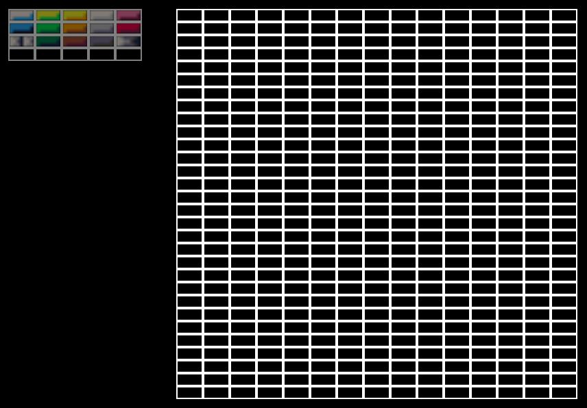
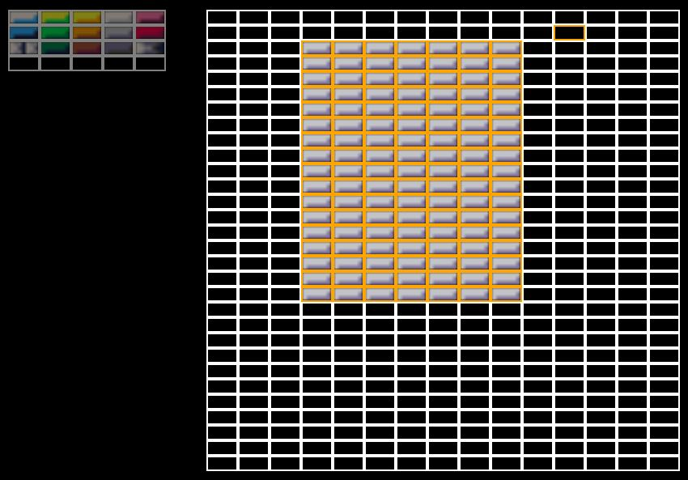
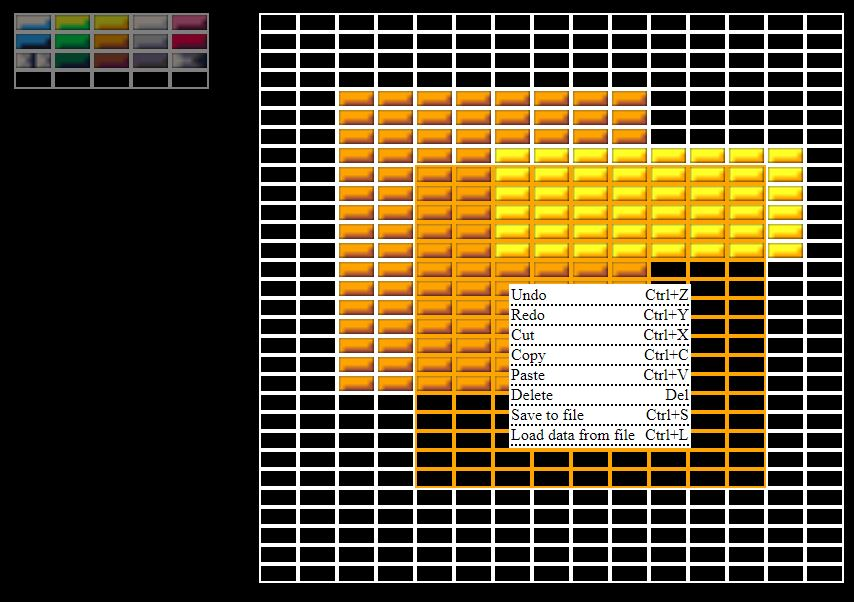

<h1>Arkanoid - level creator</h1>

In this app you can create your own level to arkanoid game.
To save your progress save it to file.
You can open menu with actions by RMB

<h2>You can alsow use shortcuts for some actions like:</h2>
<ul>
<li>Undo (Ctrl+Z)</li>
<li>Redo (Ctrl+Y)</li>
<li>Cut (Ctrl+X)</li>
<li>Copy (Ctrl+C)</li>
<li>Paste (Ctrl+V)</li>
<li>Delete (Del)</li>
<li>Save to file (Ctrl+S)</li>
<li>Load data from file (Ctrl+L)</li>
</ul>

<h2>Warning!</h2>
To test this app you need to run it on local server

<h2>Screenshots:</h2>
 

